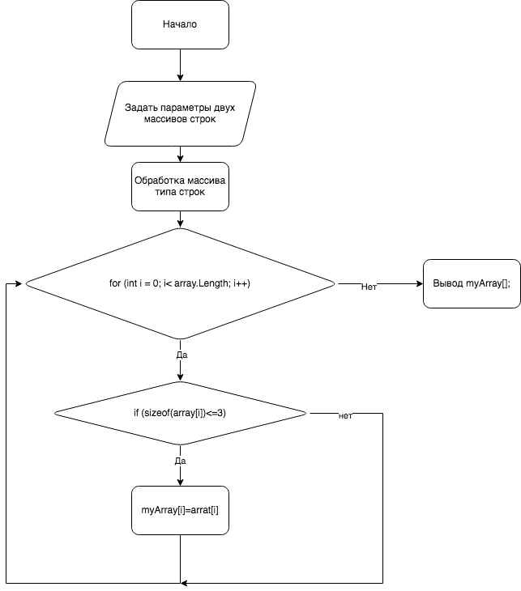

# Алгоритм решения задачи:
## Задача: Из имеющегося массива строк образует массив строк длина которых меньше либо равно 3 символа. Лучше использовать @Массивы@:                       
#
#     

#
#
Пример:
["Hello","123","word","we"]->["123","we"]